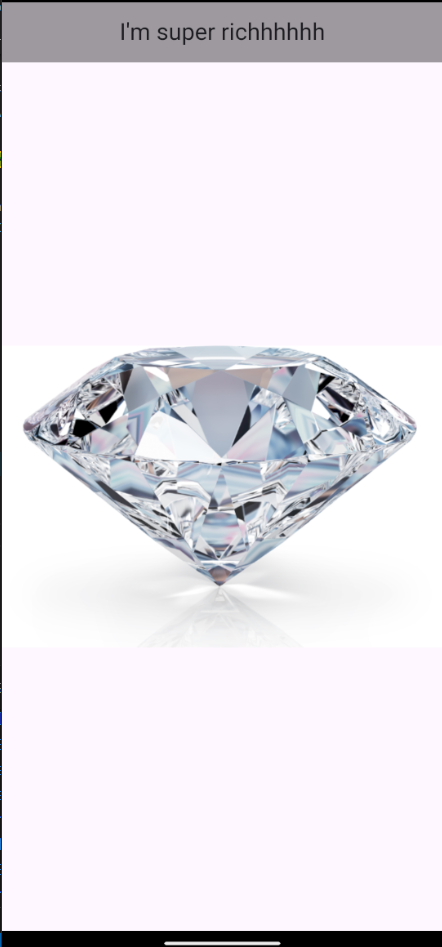

# 🚀 Flutter Projects Collection

A curated list of beginner to intermediate Flutter projects to help you learn app development from scratch. Each project includes a guided Demo video and a sample UI preview.

---

## 1. 💎 I Am Rich
**Learn:** Creating your first Flutter app from scratch  
[▶ Watch Demo](https://drive.google.com/file/d/1ZBb4Lx0VTFYRaHjca7-Wp3DRgz2BHz8q/view?usp=drive_link)  

---

## 2. 💼 MiCard
**Learn:** Building beautiful UIs with Flutter widgets  
[▶ Watch Demo](https://drive.google.com/file/d/1aEB7cUcZ6E7QKKu4MDD4KLlYedNWkoC-/view?usp=drive_link)  

---

## 3. 🎲 Dice  
**Learn:** Handling state in Flutter apps  
[▶ Watch Demo](https://drive.google.com/file/d/1UU60MuWgaYhYvh7gbalT5j0CD01gVpEz/view?usp=drive_link)  

---

## 4. 🔮 Magic 8 Ball (Challenge)  
**Learn:** State and randomness in UI interaction  
[▶ Watch Demo](https://drive.google.com/file/d/1Zf7s3N7R0zhoIU-APtY76uppM9bBaWou/view?usp=drive_link)  

---

## 5. 🎼 Xylophone  
**Learn:** Using Flutter packages and playing audio  
[▶ Watch Demo](https://drive.google.com/file/d/1WiF8_ObAtH4lrib7-mCqkbBPDF16qzmm/view?usp=drive_link)  

---

## 6. ❓ Quizzler  
**Learn:** Code modularization and organizing logic  
[▶ Watch Demo](https://drive.google.com/file/d/17G6zOgFmzNJovHq3bizm4-coeHOqpbeh/view?usp=drive_link)  

---

## 7. 🧭 Destini (Boss Level Challenge)  
**Learn:** Choose-your-own-adventure storytelling with logic  
[▶ Watch Demo](https://drive.google.com/file/d/1If_p-D9sBRPmZpruSdvySnNS4v4tQTHj/view?usp=drive_link)  

---

## 8. ⚖️ BMI Calculator  
**Learn:** Intermediate UI design with custom components  
[▶ Watch Demo](https://drive.google.com/file/d/121HiccJXarXF-Htyjhu9OxcB7A5jBl0l/view?usp=drive_link)  

---

## 9. 🌦️ Clima  
**Learn:** Working with live web APIs and dynamic data  
[▶ Watch Demo](https://drive.google.com/file/d/1PLkkLGLwy89I_XrBG-hCUN2XWPk7iBaA/view?usp=drive_link)  

---

### 📚 Ready to build your Flutter journey step-by-step?  
Start from the top and work your way down — each project builds on skills from the last. Happy coding! 💙
